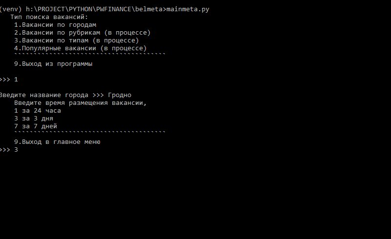
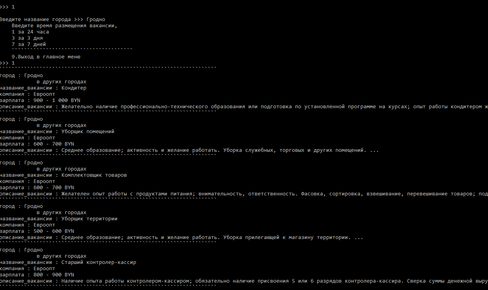

# Парсинг вакансий с сайта Belmeta с комфортом

## Руководство, шаг за шагом

1. Запуск программы: mainmeta.py

<kbd></kbd>

2. Выбор необходимого режима работы:
	1. Вакансии по городам
	2. Вакансии по рубрикам (в процессе)
	3. Вакансии по типам (в процессе)
	4. Популярные вакансии (в процессе)

<kbd></kbd>

3. Если пункт 1. Вводим город, затем время размещения вакансий:
	- за 24 часа
	- за 3 суток
	- за 7 дней

4. Выход в предыдущее меню (9), а также выход из программы (9).

