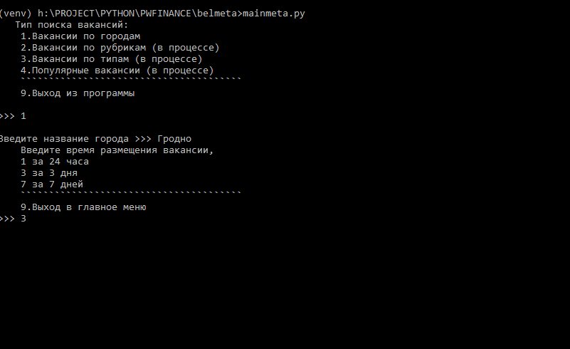
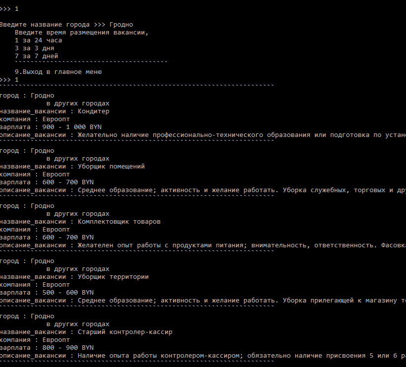

# Парсинг вакансий с сайта Belmeta с комфортом :coffee:

## Руководство, шаг за шагом

1. ***Запуск программы: mainmeta.py***

<kbd></kbd>

2. ***Выбор необходимого режима работы:***
	- Вакансии по городам
	- Вакансии по рубрикам (в процессе)
	- Вакансии по типам (в процессе)
	- Популярные вакансии (в процессе)

<kbd></kbd>

3. ***Если пункт 1. Вводим город, затем время размещения вакансий:***
	- за 24 часа
	- за 3 суток
	- за 7 дней

4. ***Выход в предыдущее меню (9), а также выход из программы (9).***

## To-Do:

	- экспорт данных в формат pdf
	- экспорт данных в формат doc
	- экспорт данных в формат xls
	- экспорт данных в формат csv

	- поиск по рубрикам
	- поиск по типам
	- поиск популярных вакансий

	- работа с уведомлениями по электронной почте

	- и тп и мн.др.

